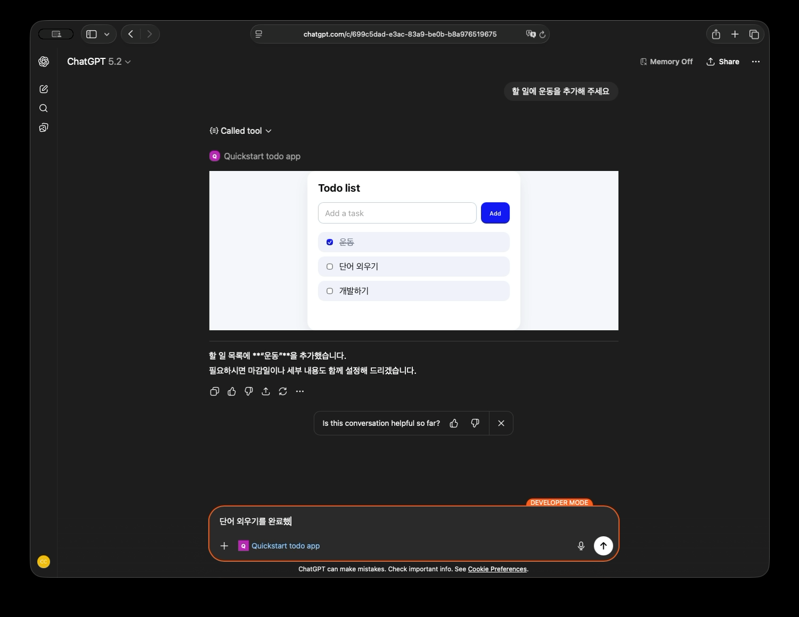
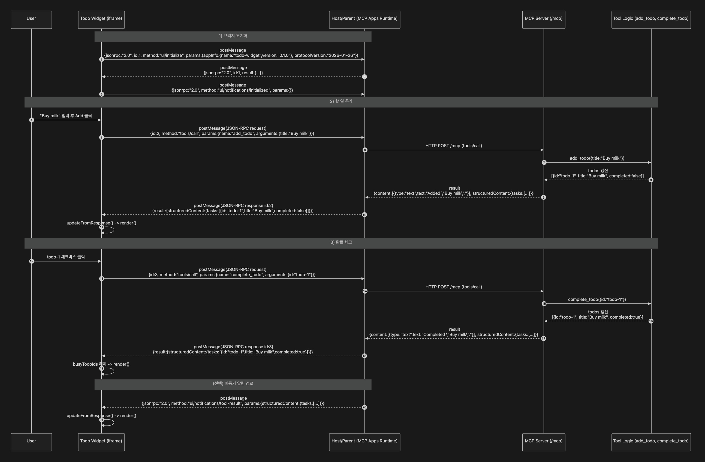

# ChatGPT Apps SDK Todo App

[ChatGPT Apps SDK 공식 문서](https://developers.openai.com/apps-sdk/quickstart)에서 제공하는 간단한 TODO 앱 예시입니다.

## 예시 화면

### GPT에서 mcp tool 호출


### 앱 직접 사용



## 요청 흐름 예시



## 테스트

### MCP 서버

```bash
npm run start:inspector # 로컬 환경에서 inspector를 이용한 테스트
npm run start:server # MCP 서버 실행
npm run start:tunnel # 로컬 MCP 서버 터널링(cloudflared 필요)
```

### ChatGPT 개발자 모드 활성화

ChatGPT 설정에서 개발자 모드 활성화 후 앱 등록 ([참고](https://developers.openai.com/apps-sdk/quickstart#add-your-app-to-chatgpt))
